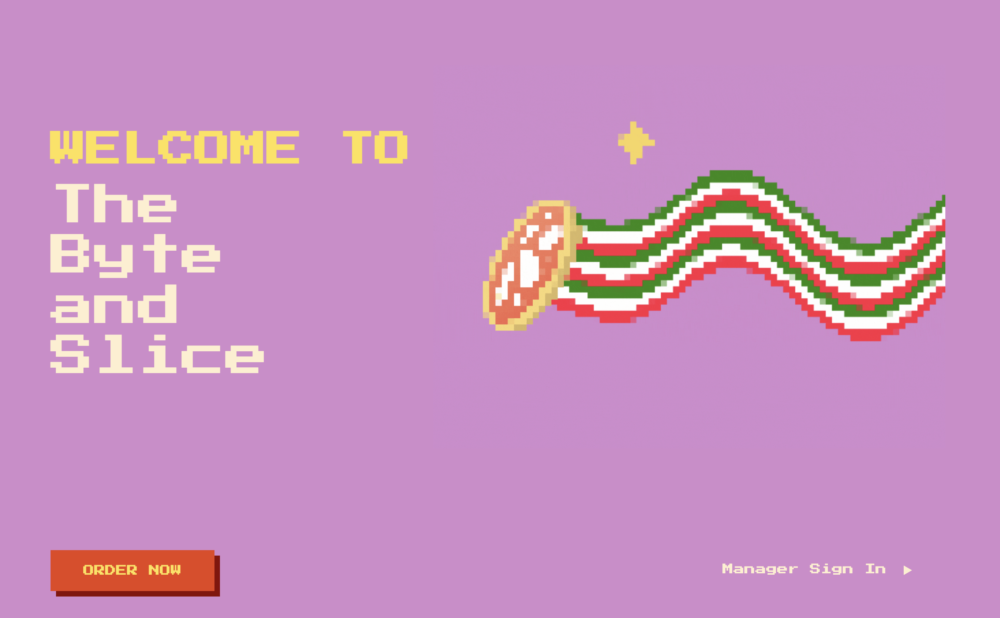

# 🍕 The Byte and Slice

**The Byte and Slice** is a full-stack pizza delivery platform where users can:
- Select their preferred location to order from
- Customize pizzas with toppings of their choice
- Submit orders for delivery
- Have all orders stored and managed in a PostgreSQL database

---

## ⚙️ Tech Stack

- **Frontend:** HTML, CSS  
- **Backend:** Python (Flask)  
- **Database:** PostgreSQL  

---

## 🚀 Features

- 📍 **Location Selection** – Choose which branch/location to order from  
- 🍕 **Customizable Toppings** – Fully interactive pizza builder  
- 📦 **Order Submission** – Orders stored in the database for fulfillment  
- 🗄️ **Database Integration** – Persistent order history using PostgreSQL  
- 🎨 **Responsive UI** – Built with clean, desktop-friendly HTML + CSS  

---
